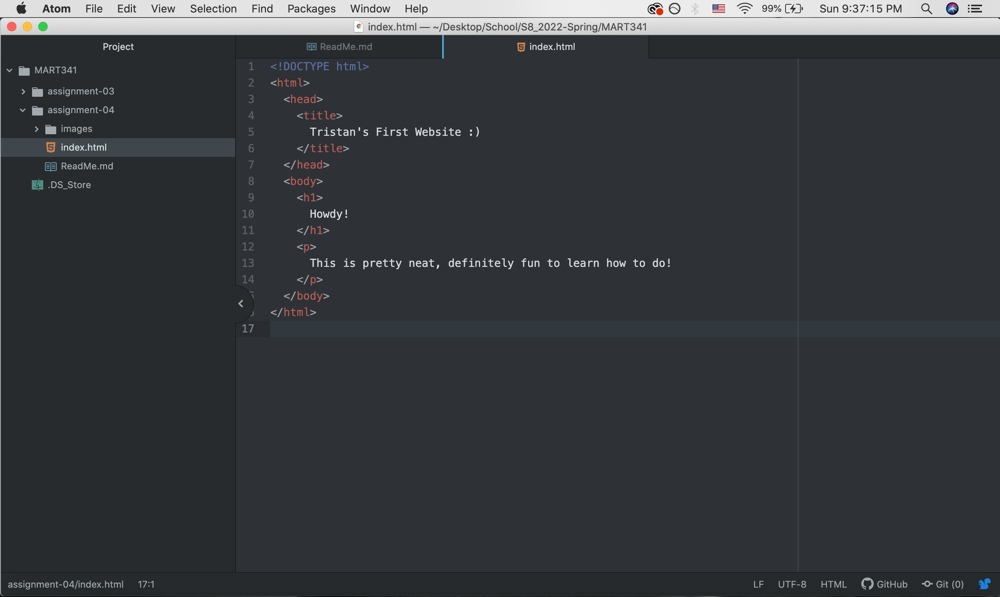

1.) Browsers are tools that are used to access the internet and translate a website's language and display a readable website, as intended by the developer. For me, I mostly use Opera on my laptop and Internet Explorer for work.

