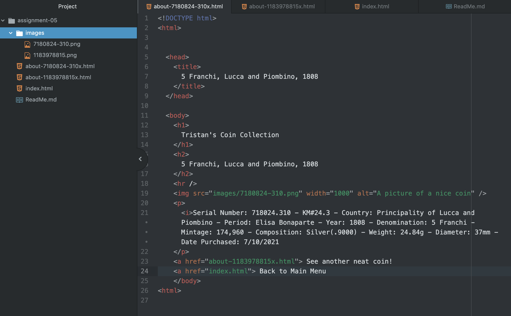

1. I visited a 1998 version of the Mansfield Library's website. Aesthetically, it's certainly a bit dated, although functionally, it seems relatively straightforward. Overall though, it's very bare-necessities, which is kinda nice in a way.

