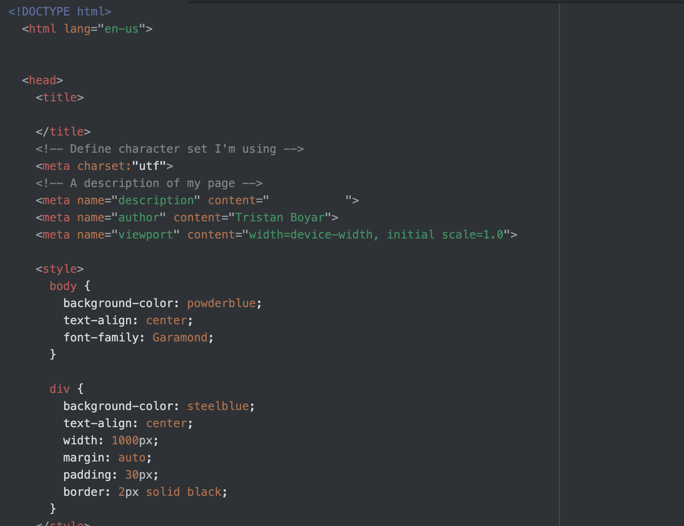

1.) An affordance is an element of an object that suggests what its function could be.
2.) Using a third party service to host your videos is really helpful for saving bandwidth, but doing so makes your video not exclusive to your site specifically, which can be an issue in some cases.
3.) I had a weird issue the the 
 element (I think?) on my page this week. I'm not really sure what happened, but the border looks kinda odd and clunky. I tried to fix it for a while, but it kinda grew on me a bit with time so I'm mostly at peace with it now :)

