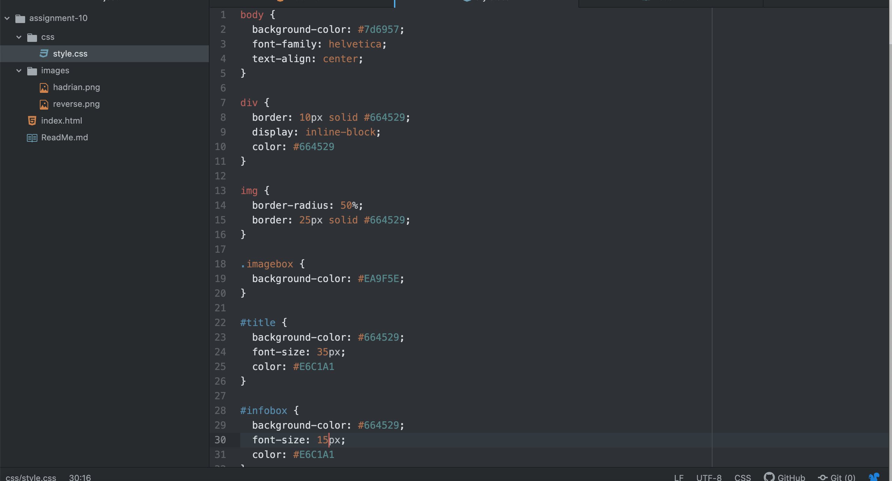

1.) A universal selector applies to the entire site, an element selector applies only to specific elements, a class selector would apply only to elements tagged with that class, and an id selector only applies to one specific thing tagged with that id. These are all useful for different purposes, for example, in a catalog-type setting, it might be useful to have a standardized set of settings for an element that might recur often, using either an element selector or a class selector to do so. If there's a desire to have those settings change only one item, an id selector could be a good idea.
2.) I chose a monochromatic scheme based on a color I took from the coin itself in photoshop. I then used the adobe color palate tool to grab some other hex codes that would work for this.

