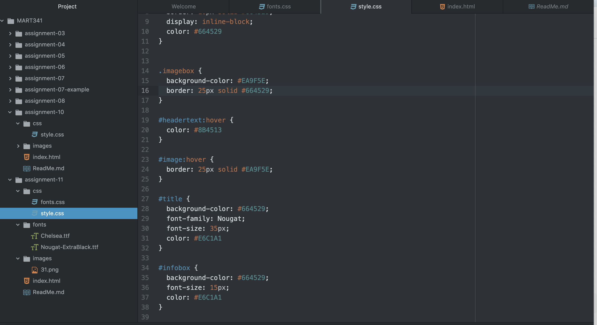

1. Typography relates to the usage of typefaces and various adjustments (size, spacing, etc.) in order to better convey the meaning of a specific work.
2. Using fallback fonts and font stacks can be important, as they allow a viewer to still see the content on the site even if the original font doesn't work on their computer for whatever reason.
3. System fonts are fonts that come from local files on one's computer, web fonts are fonts that are hosted on a server, and Web-Safe fonts are fonts that are generally assumed to already be on a user's computer, which can help in load times.

