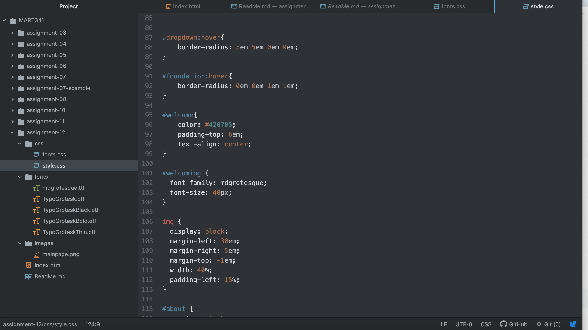

1. Borders are the edges of a specific element, padding is the space between an element and its borders, and margins are the space around a border.
2. Overall, I think I'm just having some difficulty wrapping my head around CSS as of late, so just troubleshooting a lot of issues I was having wound up taking way more time than I anticipated.

