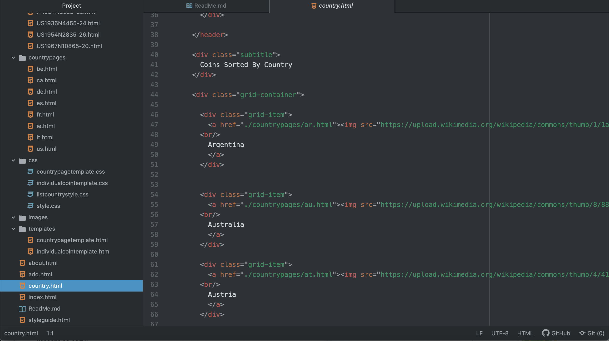

1. My ultimate goal is to create an online repository for my coin collection that I can access just about anywhere with internet connection. Ideally, this site will allow me to enter in new coins as well. I was able to set it up so that I can fill out a google form on the add page and have it autofill an html template in a google doc that I can just copy and paste to create a new page for the coin. I think that's about as good as I can do though.

2. Responsive web design is important, as it helps make a site more friendly and usable to someone, regardless of what device they use to view the site from. I do not think my site is currently very good at this, but I'm working on it :)

